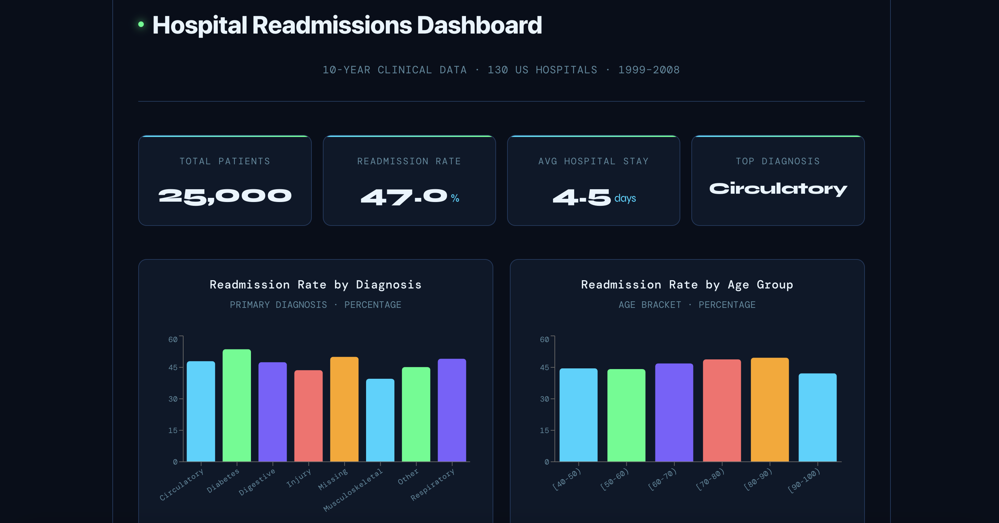

# Hospital Readmissions Dashboard

## Overview

An interactive data visualization dashboard built with React that surfaces
ten years of hospital readmission insights for diabetic patients across
130 US hospitals (1999-2008). The dashboard connects to a live REST API
backend to display real-time patient statistics, readmission rates by
diagnosis, and readmission trends by age group.

## Live Deployment

Try it yourself! [hospital-readmission-dashboard.vercel.app](https://hospital-readmission-dashboard.vercel.app)



## Backend

This dashboard is powered by the Hospital Readmissions REST API.

- **Repo:** [github.com/michellely825/Hospital-Readmissions-Api](https://github.com/michellely825/Hospital-Readmissions-Api)
- **Live API:** [hospital-readmissions-api-production.up.railway.app](https://hospital-readmissions-api-production.up.railway.app)

## Features

- Real-time patient statistics including total patients, average hospital stay, and overall readmission rate
- Interactive bar chart of readmission rates by primary diagnosis
- Interactive bar chart of readmission rates by age group
- Custom dark theme designed for clinical data readability
- Fully responsive layout

## Tech-Stack

- **Frontend:** React, Vite
- **Data Visualization:** Recharts
- **HTTP Client:** Axios
- **Deployment:** Vercel

## Dataset

- **Source:** [Kaggle - Hospital Readmissions](https://www.kaggle.com/datasets/dubradave/hospital-readmissions/data)
- **Records:** 25,000 patient encounters
- **Time Period:** 1999-2008
- **Features:** age, time in hospital, diagnoses, medications, readmission status and more

## How to Run Locally

### Prerequisites

- Node.js 18+
- npm

### Setup

1. **Clone the repository**

```bash
git clone https://github.com/michellely825/Hospital-Readmission-Dashboard.git
cd Hospital-Readmission-Dashboard
```

2. **Install dependencies**

```bash
npm install
```

3. **Start the development server**

```bash
npm run dev
```

4. **Open in browser**

```
http://localhost:5173
```

The dashboard connects to the live Railway API by default so no
additional backend setup is required to run locally!
